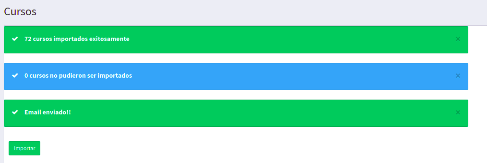

# Prueba Técnica CAR Arquitectura 2023

Plataforma web que permite gestionar los datos de estudiantes, profesores y cursos.

# Instalación

1. Clonar el repositorio https://github.com/pedroYair/prueba_tecnica_car_arq.git
2. Configurar archivo .env empleando la plantilla ubicada en config/settings/.env_example
3. Instalar requerimientos ubicados en el archivo requirements.txt
3. Ejecutar empleando:
   
   ```python 
   python manage.py runserver
   ```

# Accesos

A continuación se listan las rutas de acceso a las diferentes funcionalidades, previamente se debe crear al menos
un super usuario empleando:

```python 
python manage.py createsuperuser
```

1. Admin django: http://127.0.0.1:8000/admin/

2. Scrapper cursos: http://127.0.0.1:8000/subjects/list_subjects 




3. Importación masiva empleando archivos csv, xls o xlsx:
http://127.0.0.1:8000/base/massive_import (dentro de la carpeta fixtures se adjuntan
   archivos ejemplo para cada modelo y tipo de archivo al igual que la plantilla correspondiente)
   


4. RestApi: las urls de los microservicios creados pueden ser visualizadas en el archivo url
ubicado dentro de la carpeta api de las diferentes apps. Para los 4 modelos creados (Teacher, Student, Subject y Rating) 
se crearon las 4 actions (GET, POST, DELETE, PATCH) es decir creacion, edicion, borrar y listar,
cada una de ellas requiere autenticación mediante un token Bearer que debe ser enviado por cabecera.
   Para la gestiòn de este último se crearon microservicios para obtener el token access y el refresh.
Se adjunta en la carpeta  fixtures una colección postman con cada uno de los endpoints creados. 

# Autor

PEDRO YAIR CARABALLO VALLEJO
